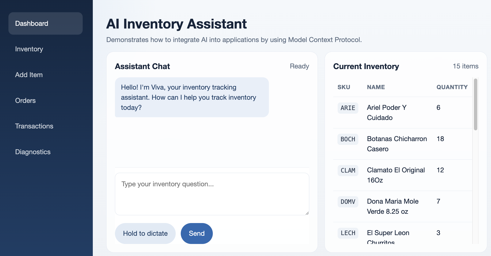

# Inventory LLM Demo

This open-source, local-first AI inventory management application developed in collaboration with an [Anthropologist from Willamette University](https://willamette.academia.edu/PeterWogan) demonstrates how small businesses can use modern local AI models to build practical tools on affordable hardware.



## Overview

This project combines a lightweight inventory database, a [Model Context Protocol](https://www.anthropic.com/news/model-context-protocol) server, and a web interface with AI-assisted workflows to demonstrate what real-world AI integration can look like.

It can run locally on a modern laptop, desktop, or small office server using local AI tooling such as [LM Studio](https://lmstudio.ai/). For simple deployments, that means businesses can experiment with AI while keeping their data and infrastructure under their own control.

This repository is a foundation, not a one-click business solution. Real-world deployments may require customizing the information stored in the database and the business logic responsible for processing database transactions, tweaking the interface between the AI agent and the application, as well as infrastructure, security, or integrations with existing systems like ordering and payments.

The goal of this project is not to pretend AI adoption is effortless. The goal is to show that modern open-source AI tools have become accessible enough that small businesses and independent developers can realistically build useful systems together.

## Background

Convenience-store workers will walk up and down the store aisles, notice which products are running low on the shelves, and then type or dictate their products-to-order list into this AI app on their phone.

Even small businesses that already have paid digital programs for note-taking might prefer this tool, due to these same three reasons (free, simple, customizable).

In fact, this [2025 study](https://www.avancim.com/en/blog/small-business-inventory-management-study) of over 2,500 small businesses found very similar reasons for why they didn’t change their inventory management system:

> 58% cite expense as the primary barrier, `42%` worry about system complexity, `38%` feel they lack time for implementation, `31%` are unaware of available solutions.

In addition, at least `25%` of small business owners speak a language other than English at home (per this [Small Business Administration 2024 study](https://advocacy.sba.gov/2024/03/25/lost-in-translation-the-effects-of-language-on-business-ownership-and-outreach/)).

Given that there are currently over `33` million small businesses in the U.S., this means approximately `8.4` million small business owners navigate their daily lives and businesses in a language other than English.

To address both needs, we demonstrated how an AI can be used entirely in Spanish on the [es-MX](https://github.com/01binary/inventory-llm/tree/es-MX) branch of this repository.

## Details

- Frontend: `/client` (Vite + React)
- Backend: `/server` (ASP.NET Core + Dapper)
- Database: `/db` (SQLite)
- Prompts:
  - `SYSTEM_PROMPT.md`
  - `STARTUP_PROMPT.md`
  - `FEW_SHOT_PROMPTS.json`
- [Training Notebook](https://www.kaggle.com/code/valnovytskyy/inventory-gemma)
- [Trained Model](https://huggingface.co/valnovytskyy/inventory-gemma-12B)

The backend serves both API endpoints and MCP tools at `/mcp`. This means that the frontend is technically optional - you can run just the MCP server and pair that with a desktop AI agent like [LM Studio](https://lmstudio.ai/), [Claude Desktop](https://code.claude.com/docs/en/desktop-quickstart) or [Codex](https://chatgpt.com/codex/switch-to-codex/) to manage the inventory without a web interface.

The chat layer proxies completions to an OpenAI-compatible endpoint (LM Studio by default).

## Prerequisites

- Docker Desktop (for containerized run)
- LM Studio local server running on `http://localhost:1234`
- macOS, Windows, or Linux

## Configuration

Copy `.env.example` to `.env` (only if `.env` does not exist yet).

Default `.env` values:

```env
LLM_BASE_URL=http://host.docker.internal:1234
LLM_MODEL=auto
LLM_COMPLETION_PATH=/v1/chat/completions
LLM_HEALTH_PATH=/v1/models
MCP_SERVER_URL=http://localhost:8080/mcp
```

`LLM_MODEL=auto` means the backend picks the first model returned by `GET /v1/models`.

## Quick Start (Docker)

macOS:

```bash
chmod +x scripts/*.command
./scripts/start.command
```

Windows:

```bat
scripts\start.bat
```

Linux:

```bash
cp -n .env.example .env
mkdir -p docker/data/sqlite
docker compose up -d --build
```

App URL: `http://localhost:8080`

Stop:

- macOS: `./scripts/stop.command`
- Windows: `scripts\stop.bat`
- Linux: `docker compose down`

Linux note: if LM Studio is running on your host machine (not in Docker), set `LLM_BASE_URL` in `.env` to a host-reachable address like `http://172.17.0.1:1234` instead of `host.docker.internal`.

## Local Dev (without app container)

1. Stop app container:

```bash
docker compose stop app
```

2. Run backend:

```bash
cd server
dotnet run
```

3. Run frontend:

```bash
cd client
npm install
npm start
```

Dev URLs:

- Frontend: `http://localhost:5173`
- Backend: `http://localhost:5184`

## Current Features

- Inventory management (list/create/update/delete)
- Inventory transaction log
- Chat assistant with MCP tool calling
- Orders workflow:
  - create multi-item orders
  - append items to latest order across turns
  - view orders page with expandable order lines
- Browser STT/TTS voice interaction (no Whisper/Piper containers)

## API Endpoints

- `GET /api/health`
- `GET /api/config`
- `GET /api/items`
- `GET /api/items/{id}`
- `GET /api/items/validate-sku?sku=...`
- `POST /api/items`
- `PUT /api/items/{id}`
- `DELETE /api/items/{id}`
- `GET /api/transactions`
- `GET /api/orders`
- `GET /api/orders/latest`
- `GET /api/orders/{orderNumber}`
- `POST /api/orders`
- `POST /api/orders/latest/items`
- `POST /api/chat/complete`
- `GET /api/chat/system-prompt`
- `GET /api/chat/hello-prompt`
- `GET /api/chat/few-shot-prompts`

## MCP Tools

- `inventory_list_items`
- `inventory_search_status`
- `inventory_add_transaction`
- `orders_get_latest`
- `orders_create`
- `orders_add_items_to_latest`
- `orders_set_latest_item_quantities`
- `orders_remove_items_from_latest`

## Troubleshooting

The diagnostics page in the app can help troubleshoot issues with configuration and running services.

- Verify LM Studio is reachable: `http://localhost:1234/v1/models`
- If chat works but tool calling fails, verify backend MCP URL config:
  - `MCP_SERVER_URL=http://localhost:8080/mcp`
- If no seed data appears, check DB volume at `docker/data/sqlite`

## Minimal AI Setup Notes

- Confirm tools are installed: `docker`, `docker compose`, `dotnet`, `node`, `npm`.
- Ensure `.env` exists (`cp -n .env.example .env`).
- For Linux + Docker + host LM Studio, verify `LLM_BASE_URL` is reachable from containers.
- Use diagnostics page at `http://localhost:8080/diagnostics` for quick health checks.

## First Files to Customize

- `SYSTEM_PROMPT.md`
- `STARTUP_PROMPT.md`
- `FEW_SHOT_PROMPTS.json`
- `db/002_seed.sql`
- `server/appsettings.json`
- `client/src/styles.css`

## Branch Localization Workflow

- `main` is the English baseline (`en-US`).
- `es-MX` keeps Spanish locale defaults and prompts.
- To sync feature changes from `main` into `es-MX` while preserving Spanish locale files:

```bash
git switch es-MX
./scripts/merge-main-into-es-mx.sh
git push
```
